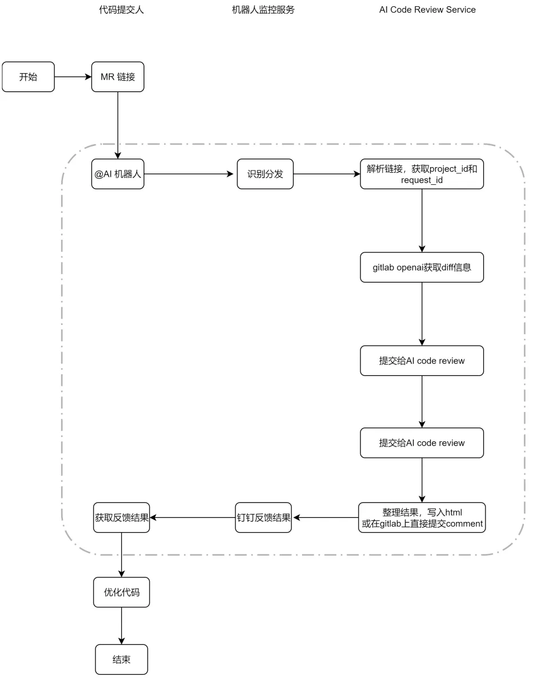

# ios端cr机器人开发流程

## 一、cr机器人流程


**使用：**

- 由代码提交者提交 MR 后在钉钉 写入mr地址并 @机器人。
- 由cr机器人自动完成CR过程，处理成功之后会在钉钉群中发送处理结果消息并@代码提交者

## 二、平台实现

### 0、引申问题

- **mr列表处理（已解决）**
  
  - **通过kafka异步消费mr地址**

- **对于diffs大文件的处理**
  
  - 无用大文件：大文件如果所设计的文件不需要进行 cr 处理。比如 除代码文件、无用的 json 信息文件
  
  - 有用大文件：如果文件过于大是否需要进行 cr，以及是否拆分，涉及到性能问题

- **根据文件类型或者某些逻辑过滤diff**

- **根据文件后缀过滤一些不需要的diff**

- **过滤掉只涉及删除的diff**

- **对于gitlab 没有提供 批量方式一次提交所有的comment，****导致每次需要发送一次http请求，提交一行评论。****（已解决）**

- 如果commet过多 调用的http次数过多会存在以下问题：
  
  - 解决：cr机器人工具类项目对数据一致性不高可忽略 多次重试失败的极端问题，用kafka解决重试，重试次数为2次，kafka异步解决AI调用耗时和提交comment

### 1、流程图




### 2、MR和diff信息处理

#### 通过mr获取diff信息

```json
"https://git.yupaopao.com/terminal/ios/yuer/YRSwiftDemo/merge_requests/1/diffs
 https://git.yupaopao.com/terminal/ios/yuer/YRSwiftDemo/merge_requests/2/diffs
 https://git.yupaopao.com/terminal/ios/yuer/YRSwiftDemo/merge_requests/3/diffs"
```

其中 **YRSwuftDemo** 对应的为 项目名称 ，**1 2 3**对应的 请求合并id

**实现步骤：**

- 代码提交人可能会提交多个mr地址，需要对多个地址字符串通过正则表达式（ **\n+| +** ）分别拆分成单个列表mr地址

- 获取单个mr地址 再次通过正则表达式（ **/(\w+)/merge_requests/(\d+)**）获取到 项目名称和请求id
  
     此时需要通过调用(https://app.yupaopao.com/api/ci/list?curPage=1&platform=iOS&keyword=YRSwiftDemo)
     接口获取对应项目的项目id转换为 gitlab的diff接口调用地址：
     [https://git.yupaopao.com/api/v4/projects/{project_id}/merge_requests/{request_id}/changes](https://git.yupaopao.com/api/v4/projects/{project_id}/merge_requests/{request_id}/changes)

- 调用该接口获取本次mr请求所有diff信息，对单个diff信息进行封装为 DiffInfo对象

> 一个mr地址会产生多个diffInfo对象
>  一个diffInfo对象（**对应于一个具体文件的更改**）
> 一个diffInfo对象对应多个diffFeedback对象

```java
public class DiffInfo {
    private MergeRequestInfo mergeRequestInfo;
    private String fileSuffix;
    private String operationType; //new delete modify
    private String diff;
    private String oldPath;
    private String newPath;
    private Map<String, LineMapping> lineMap ; //diff 去除空格的行代码的新旧行号映射

}


public class LineMapping {
    private Integer oldLine;
    private Integer newLine;
}

public class MergeRequestInfo {
    /**
     * 合并请求的 基本 SHA、主 SHA 和起始 SHA
     * 三个SHA的作用：作为接口调用 提交comments 发表评论所需的参数
     */
    private Integer id;//mr的id 对应gitlab API文档为 merge_request_iid
    private Integer projectId;
    private String changesUrl; //获取diffs接口地址 https://git.yupaopao.com/api/v4/projects/7484/merge_requests/1/changes
    private String baseSha;
    private String headSha; //一次mr地址对应的sha
    private String startSha;
    private String margeRequestUrl;
    private String title;//mr的标题
    private String description;//mr的描述
    private String atUserLoginName;//钉钉@cr机器人的那个人，用作发送消息
    private String atUserGroupChat;//钉钉@cr机器人的群聊
}

public class DiffFeedback {

    private DiffInfo diffInfo;
    private String codeContent; //该行代码
    private String amendmentBody;//修改意见
    private LineMapping lineMapping; //要commit的代码行号


}
```

**对象实例：**

```json
{
    "diff": "@@ -16,6 +16,18 @@ import YppSoraka\n import MJExtension\n import UIKit\n \n+import YppLayout\n+import YppBubbleMaker\n+import YppShare\n+\n+@objcMembers public class SwiftCallOC: NSObject {\n+     Public func invokEAll() {\n+\n+            DispatchQueue.main.asyncAfter(deadline: .now()+3, execute: {\n+                self.invokeAFN()\n+            })\n+        }\n+}\n @objcMembers public class SwiftCallOC: NSObject {\n     public func invokeAll() {\n         \n",
    "fileSuffix": "swift",
    "lineMap": {
        "": {
            "newLine": 33,
            "oldLine": 21
        },
        "+@objcMemberspublicclassSwiftCallOC:NSObject{": {
            "newLine": 23
        },
        "importMJExtension": {
            "newLine": 16,
            "oldLine": 16
        },
        "@objcMemberspublicclassSwiftCallOC:NSObject{": {
            "newLine": 31,
            "oldLine": 19
        },
        "+PublicfuncinvokEAll(){": {
            "newLine": 24
        },
        "+": {
            "newLine": 25
        },
        "+importYppShare": {
            "newLine": 21
        },
        "+}": {
            "newLine": 30
        },
        "importUIKit": {
            "newLine": 17,
            "oldLine": 17
        },
        "publicfuncinvokeAll(){": {
            "newLine": 32,
            "oldLine": 20
        },
        "+})": {
            "newLine": 28
        },
        "+self.invokeAFN()": {
            "newLine": 27
        },
        "+DispatchQueue.main.asyncAfter(deadline:.now()+3,execute:{": {
            "newLine": 26
        },
        "+importYppLayout": {
            "newLine": 19
        },
        "+importYppBubbleMaker": {
            "newLine": 20
        }
    },
    "mergeRequestInfo": {
        "atUserGroupChat": "语音IOS代码CR群",
        "atUserLoginName": "huangxiaolong",
        "baseSha": "6467f8d27a2fd1ce76d068f6ba177dbf1c7ce562",
        "changesUrl": "https://git.yupaopao.com/api/v4/projects/7484/merge_requests/3/changes",
        "description": "",
        "headSha": "7fd4ab574ee72008338ca4b978108185abc87388",
        "id": 3,
        "margeRequestUrl": "https://git.yupaopao.com/terminal/ios/yuer/YRSwiftDemo/merge_requests/3",
        "projectId": 7484,
        "startSha": "2bb90c392ddd6a9220f8d5edec4908afce237cd9",
        "title": "导入了包"
    },
    "newPath": "Pods/Classes/SwiftCallOC.swift",
    "oldPath": "Pods/Classes/SwiftCallOC.swift",
    "operationType": "modify"
}
```

#### diff格式

> @@ -14,7 +14,7 @@
> -14,7 表示原文件的起始行是第14行。而`,7`表示旧文件从14行开始的连续7行
> +14,7 表示新文件的起始行是第14行。`,7`表示新文件从14行开始的连续7行
> 文件中 - + 即表示 旧代码和新代码，未标识- +的即为原始上下代码参照

原始diff字符串：

    @@ -14,7 +14,7 @@ import AFNetworking
    
    import YppAccountService
    
    import YppSoraka
    
    import MJExtension
    
    -
    
    +import UIKit
    
    @objcMembers public class SwiftCallOC: NSObject {
    
    public func invokeAll() { 


### 3、变更行计算


***计算变更行：***

以 @@ -16,6 +16,18 @@ **开始 获取 **旧起始行16** 和**新起始行16**，以\n分割一行代码。

- **+ 号开头** 新行+1，旧行不变

- **- 号开头** 旧行+1 新行不变

- **不出现-+** 新旧行同时+1

```python
@@ -17,6 +17,16 @@ import MJExtension


 @objcMembers public class SwiftCallOC: NSObject {
+    
+    var callback: ((Int) -> Void)?
+    
+    init() {
+        callback = { i in
+            self.printSomething(i)
+        }
+    }
+    
+    
     public func invokeAll() {

         DispatchQueue.main.asyncAfter(deadline: .now()+3, execute: {
@@ -39,7 +49,7 @@ import MJExtension

             self.invokeYppSoraka(event: "数据", args: string)

-            let label = UILabel.init(frame: CGRect(x: 0, y: 100, width: self.currentView().frame.size.width, height: self.currentView().frame.size.height - 200))
+//            let label = UILabel.init(frame: CGRect(x: 0, y: 100, width: self.currentView().frame.size.width, height: self.currentView().frame.size.height - 200))
             self.currentView().addSubview(label)
             label.backgroundColor = UIColor.white
             label.numberOfLines = 0;
@@ -55,7 +65,8 @@ import MJExtension
     }

     func currentView() -> UIView {
-        guard let rootView = UIApplication.shared.keyWindow?.rootViewController?.view else { return UIView.init() }
+//        guard let rootView = UIApplication.shared.keyWindow?.rootViewController?.view else { return UIView.init() }
+        guard let rootView = UIApplication.shared.delegete?.windows?.first else { return UIView.init() }
         return rootView;
     }

@@ -64,6 +75,13 @@ import MJExtension
          guard let str = String(data: data!, encoding: String.Encoding.utf8) else { return "" }
          return str
      }
+    
+    func printSomething(_ i: Int) {
+        // other code .....
+        print("print: \(i)")
+        printSomething(i)
+        // other code .....
+    }
 }


```
**转换为LineMapping 对象格式：**
```json
{
    "": {
        "newLine": 87,
        "oldLine": 69
    },
    "-letlabel=UILabel.init(frame:CGRect(x:0,y:100,width:self.currentView().frame.size.width,height:self.currentView().frame.size.height-200))": {
        "oldLine": 42
    },
    "label.numberOfLines=0;": {
        "newLine": 55,
        "oldLine": 45
    },
    "returnstr": {
        "newLine": 76,
        "oldLine": 65
    },
    "guardletstr=String(data:data!,encoding:String.Encoding.utf8)else{return\"\"}": {
        "newLine": 75,
        "oldLine": 64
    },
    "label.backgroundColor=UIColor.white": {
        "newLine": 54,
        "oldLine": 44
    },
    "+init(){": {
        "newLine": 23
    },
    "publicfuncinvokeAll(){": {
        "newLine": 30,
        "oldLine": 20
    },
    "+print(\"print:\(i)\")": {
        "newLine": 81
    },
    "+guardletrootView=UIApplication.shared.delegete?.windows?.firstelse{returnUIView.init()}": {
        "newLine": 69
    },
    "self.invokeYppSoraka(event:\"数据\",args:string)": {
        "newLine": 50,
        "oldLine": 40
    },
    "+//letlabel=UILabel.init(frame:CGRect(x:0,y:100,width:self.currentView().frame.size.width,height:self.currentView().frame.size.height-200))": {
        "newLine": 52
    },
    "+printSomething(i)": {
        "newLine": 82
    },
    "+//guardletrootView=UIApplication.shared.keyWindow?.rootViewController?.viewelse{returnUIView.init()}": {
        "newLine": 68
    },
    "+funcprintSomething(_i:Int){": {
        "newLine": 79
    },
    "+//othercode.....": {
        "newLine": 83
    },
    "@objcMemberspublicclassSwiftCallOC:NSObject{": {
        "newLine": 19,
        "oldLine": 19
    },
    "+": {
        "newLine": 78
    },
    "+callback={iin": {
        "newLine": 24
    },
    "self.currentView().addSubview(label)": {
        "newLine": 53,
        "oldLine": 43
    },
    "+varcallback:((Int)->Void)?": {
        "newLine": 21
    },
    "+}": {
        "newLine": 84
    },
    "DispatchQueue.main.asyncAfter(deadline:.now()+3,execute:{": {
        "newLine": 32,
        "oldLine": 22
    },
    "+self.printSomething(i)": {
        "newLine": 25
    },
    "-guardletrootView=UIApplication.shared.keyWindow?.rootViewController?.viewelse{returnUIView.init()}": {
        "oldLine": 58
    },
    "}": {
        "newLine": 85,
        "oldLine": 67
    },
    "funccurrentView()->UIView{": {
        "newLine": 67,
        "oldLine": 57
    },
    "returnrootView;": {
        "newLine": 70,
        "oldLine": 59
    }
}
```

```java
private void computeDiffChangedLine(DiffInfo diff) {
    if (diff == null || diff.getDiff() == null) {
        return;
    }
    //清除所有空格 以换行分割代表一行代码，再去除空格
    String diff_content = diff.getDiff();
    List<String> linesList = Arrays.stream(diff_content.split("\n")).map(s -> s.replace(" ", "")).collect(Collectors.toList());

    int new_file_line = 0;
    int old_file_line = 0;
    Map<String, LineMapping> line_map = new HashMap<>();

    for (String line : linesList) {
        //获取起始 新行，旧行
        if (line.startsWith("@@")) {
            String[] chars = line.split("@@")[1].split("[-,+]"); // ['', '39', '7', '49', '7', 'importMJExtension']
            old_file_line = Integer.parseInt(chars[1]);
            new_file_line = Integer.parseInt(chars[3]);

        } else {

            if (line.startsWith("-")) {//删除代码行
                line_map.put(line, new LineMapping(old_file_line, null));
                old_file_line++;

            } else if (line.startsWith("+")) {//新增代码行
                line_map.put(line, new LineMapping(null, new_file_line));
                new_file_line++;
            } else {//未更改的都+1
                line_map.put(line, new LineMapping(old_file_line, new_file_line));
                old_file_line++;
                new_file_line++;
            }

        }
    }
    diff.setLineMap(line_map);

}
```

### 4、AI结果模板与字符串相似度匹配

**content中原始信息，从reviews中解析数组，放入Array，对content与LineMapping做等值匹配和模糊匹配**

```json
{
    "id": "cqu56gmbi7sbqkl0me60",
    "model": "kimi",
    "object": "chat.completion",
    "choices": [
        {
            "index": 0,
            "message": {
                "role": "assistant",
                "content": "{\n  \"reviews\": [\n    {\n      \"content\": \"+    var callback: ((Int) -> Void)?\",\n      \"comment\": \"定义了一个回调闭包，但是没有在文档或注释中说明其用途和使用场景，建议添加相应的注释说明。\"\n    },\n    {\n      \"content\": \"+        callback = { i in\",\n      \"comment\": \"闭包的初始化方式是正确的，但是闭包内部调用了自身，这可能导致无限递归，需要确保逻辑上是安全的，否则可能引起栈溢出。\"\n    },\n    {\n      \"content\": \"+//            let label = UILabel.init(frame: CGRect(x: 0, y: 100, width: self.currentView().frame.size.width, height: self.currentView().frame.size.height - 200))\",\n      \"comment\": \"这行代码被注释掉了，如果这是有意为之，请确保有相应的替代逻辑。如果是为了删除，那么注释它是一个好的做法。\"\n    },\n    {\n      \"content\": \"+        guard let rootView = UIApplication.shared.delegete?.windows?.first else { return UIView.init() }\",\n      \"comment\": \"这里将 `delegate` 错误地写成了 `delegete`，并且使用 `UIApplication.shared.delegete?.windows?.first` 来获取根视图可能不是最佳实践，因为 `delegate` 属性在 iOS 13 中已被废弃。建议使用 `SceneDelegate` 或者 `UIWindowScene` 来获取当前的视图窗口。\"\n    },\n    {\n      \"content\": \"+    func printSomething(_ i: Int) {\",\n      \"comment\": \"这个方法同样存在无限递归的问题，`printSomething(i)` 应该被修改以避免无限循环。此外，方法的实现细节被省略了，建议添加必要的日志或其他输出以确保方法按预期工作。\"\n    }\n  ]\n}"
            },
            "finish_reason": "stop"
        }
    ],
    "usage": {
        "prompt_tokens": 1,
        "completion_tokens": 1,
        "total_tokens": 2
    },
    "created": 1723618114
}
```

```json
{
  "reviews": [
    {
      "content": "+    var callback: ((Int) -> Void)?",
      "comment": "新增的`callback`属性是一个很好的实践，它允许类的使用者自定义行为。但是，最好在文档或注释中说明这个属性的用途和使用方式。"
    },
    {
      "content": "+        callback = { i in",
      "comment": "这里使用了闭包来初始化`callback`，但闭包内部又调用了`self.printSomething(i)`，这可能会导致循环引用，如果`printSomething`方法内部也持有`self`的强引用的话。建议检查`printSomething`方法实现，确保没有循环引用的问题。"
    },
    {
      "content": "+        self.printSomething(i)",
      "comment": "如果`printSomething`方法内部有递归调用，需要确保有退出递归的条件，否则可能会导致栈溢出。"
    },
    {
      "content": "-            let label = UILabel.init(frame: CGRect(x: 0, y: 100, width: self.currentView().frame.size.width, height: self.currentView().frame.size.height - 200))",
      "comment": "原来的代码被注释掉了，看起来是想移除UILabel的创建。如果这是有意为之，确保移除UILabel后，相关的业务逻辑仍然正确。"
    },
    {
      "content": "+        guard let rootView = UIApplication.shared.delegete?.windows?.first else { return UIView.init() }",
      "comment": "这里将`UIApplication.shared.keyWindow?.rootViewController?.view`更改为`UIApplication.shared.delegete?.windows?.first`，这个改动可能是为了获取当前活跃的窗口。但是，使用`delegete`可能是一个拼写错误，应该是`delegate`。同时，`windows`应该是`delegate?.windowScenes?.first?.windows?.first`，以确保获取到正确的窗口。"
    },
    {
      "content": "+    func printSomething(_ i: Int) {",
      "comment": "新增的`printSomething`方法看起来是用于打印信息，但是方法内部的递归调用没有明确的退出条件，这可能会导致无限递归和程序崩溃。需要添加适当的逻辑来终止递归。"
    }
  ]
}
```

**算法如下：**

```java
  private boolean matchCodeLineNumber(DiffFeedback diffFeedback) {
        //匹配对应行
        String lineCode = diffFeedback.getCodeContent().replace(" ", "");
        Map<String, LineMapping> lineMap = diffFeedback.getDiffInfo().getLineMap();
        //等值匹配
        LineMapping mapping = lineMap.get(lineCode);
        //行号等值匹配失败 模糊匹配
        if (mapping == null) {

            //字符串匹配度最高匹配
            //通过编辑距离算法 获取匹配度最高的
            Map.Entry<String, LineMapping> entry = entries.stream().max((k, v) -> {
                int kk = calculateSimilarity(k.getKey(), lineCode);
                int vv = calculateSimilarity(v.getKey(), lineCode);
                return kk - vv;
            }).orElse(null);          
        }

    }


    private static int calculateSimilarity(String input, String target) {
        // 计算两个字符串的最大长度
        int maxLength = Math.max(input.length(), target.length());
        // 编辑距离算法 计算Levenshtein距离
        Integer editDistance = levenshteinDistance.apply(input, target);
        // 根据Levenshtein距离计算相似度
        return (int) ((1.0 - (double) editDistance / maxLength) * 100);
    }
```

### 5、回写comments到Gitlab

#### 提交comment接口调用

**gitlab接口文档 ：**[Discussions API | GitLab](https://docs.gitlab.com/ee/api/discussions.html#create-new-merge-request-thread)

回填comment接口 POST [https://git.yupaopao.com/api/v4/projects/7484/merge\_requests/1/discussions](https://git.yupaopao.com/api/v4/projects/7484/merge%5C_requests/1/discussions)

7484对应project_id 1对应request_iid

```json
{
    "body":"postman接口测试内容",
    "position": {
                    "base_sha": "cdd6cf0e8e0dd3f6fd3f9435d648ef46927d279b",
                    "start_sha": "cdd6cf0e8e0dd3f6fd3f9435d648ef46927d279b",
                    "head_sha": "f122047bbb0bf887a1aecd13f3dd7f2062913433",
                    "old_path": "Pods/Classes/SwiftCallOC.swift",
                    "new_path": "Pods/Classes/SwiftCallOC.swift",
                    "position_type": "text",
                    "old_line": null,
                    "new_line": 21
                }  
}
```

base_sha、start_sha、head_sha可通过获取(获取最新条记录) GET [https://git.yupaopao.com/api/v4/projects/7484/merge\_requests/1/versions](https://git.yupaopao.com/api/v4/projects/7484/merge%5C_requests/1/versions)

old_path、new_path 可通过获取 GET [https://git.yupaopao.com/api/v4/projects/7484/merge\_requests/1/changes](https://git.yupaopao.com/api/v4/projects/7484/merge%5C_requests/1/changes)

> **new_line和old_line必须对应diff文件的修改行(增加 修改)**
> **否则会出现接口调用如下错误：**
> {
> "message": "400 (Bad request) "Note {:line_code=>["can't be blank", "must be a valid line code"]}" not given"
> } 

### 6、kafka异步

 kafka相关：

> **topic**：cr_test_ai
> **key**：cr_ai_invoke、cr_ai_result
> cr_ai_invoke对应分区1（用于异步调用AI接口获取反馈结果 （耗时））
> cr_ai_result对应于分区0 （异步调用 写入comment到gitlab（gitlab官方只提供了 提交一次单行代码建议接口））
> 设置重试次数为2，异常时会再次重试。
> 设置多线程消费为2，后期可以再做修改


### 7、Redis记录

> key：cr_mr_mrurl （mrurl表示一次mr请求对应的url）
> 
> - 记录该mr地址的diff_total和AI反馈的行建议comment_total
> - 调用AI接口处理时记录diff_completed_count数量 （表示已经由AI处理完的diff数量）
> - 调用gitlab接口回填comment时记录comment_completed_count（表示已经提交到gitlab的数量）
> 
> 当处理的数量与总数量相同时 即代表处理完成，如果不相等可做失败兜底（待完善） 

## 三、AI大模型

### 选型

**模型搭建：**

- **模型**：本地部署大模型+本地知识库

所有的流程都在内部执行，不会有泄露数据的风险。

- **Review的有效性** = 模型选择 + 合适的prompt

选择模型的参数当然是越多越好，越多的参数也就意味着更高的准确性，但是越多的参数也需要越好的硬件设备。一般7b需要8G内存，13b需要16G内存等等。

本地机器为32G内存，所以基本上选择模型在32b左右。

### AI返回值

```json
{
  "reviews": [
    {
      "content": "+    var callback: ((Int) -> Void)?",
      "comment": "新增的`callback`属性是一个很好的实践，它允许类的使用者自定义行为。但是，最好在文档或注释中说明这个属性的用途和使用方式。"
    },
    {
      "content": "+        callback = { i in",
      "comment": "这里使用了闭包来初始化`callback`，但闭包内部又调用了`self.printSomething(i)`，这可能会导致循环引用，如果`printSomething`方法内部也持有`self`的强引用的话。建议检查`printSomething`方法实现，确保没有循环引用的问题。"
    },
    {
      "content": "+        self.printSomething(i)",
      "comment": "如果`printSomething`方法内部有递归调用，需要确保有退出递归的条件，否则可能会导致栈溢出。"
    },
    {
      "content": "-            let label = UILabel.init(frame: CGRect(x: 0, y: 100, width: self.currentView().frame.size.width, height: self.currentView().frame.size.height - 200))",
      "comment": "原来的代码被注释掉了，看起来是想移除UILabel的创建。如果这是有意为之，确保移除UILabel后，相关的业务逻辑仍然正确。"
    },
    {
      "content": "+        guard let rootView = UIApplication.shared.delegete?.windows?.first else { return UIView.init() }",
      "comment": "这里将`UIApplication.shared.keyWindow?.rootViewController?.view`更改为`UIApplication.shared.delegete?.windows?.first`，这个改动可能是为了获取当前活跃的窗口。但是，使用`delegete`可能是一个拼写错误，应该是`delegate`。同时，`windows`应该是`delegate?.windowScenes?.first?.windows?.first`，以确保获取到正确的窗口。"
    },
    {
      "content": "+    func printSomething(_ i: Int) {",
      "comment": "新增的`printSomething`方法看起来是用于打印信息，但是方法内部的递归调用没有明确的退出条件，这可能会导致无限递归和程序崩溃。需要添加适当的逻辑来终止递归。"
    }
  ]
}
```

### prompt

Prompt反馈出diff中的问题应该尽可能多、准确，且输出稳定
***使用的prompt：***

```python
        Act as a code reviewer of a GitLab merge request, providing feedback on the code changes below.
        You are provided with the merge request changes in a diff format.
        The diff which is get from the GitLab API: api/v4/projects/projectId/merge_requests/requestId/changes.
        \n\n
        Diff of the merge request to review:
        \n
        {content}
        \n\n
        As a code reviewer, your task is:
        - Review the code changes (diffs) in the patch and provide feedback.
        - If there are any bugs, highlight them. 
        - Does the code do what it says in the commit messages?
        - Do not highlight minor issues and nitpicks.
        - Do not include any explanations, only provide a RFC8259 compliant JSON response following this format without deviation.
        - Provide the response in following JSON format:  {{"reviews": [{{"content": <line_content>, "comment": "<review comment>"}}]}}
        - the<line_content> must be the original line in Diff, and there is only one line. No characters in the line can be omitted, including + - spaces, etc.
        - please use chinese to give feedback.`
```

***分析prompt：***

**该diff地址**：https://git.yupaopao.com/terminal/ios/yuer/YRSwiftDemo/merge_requests/1/diffs

**使用的模型：** kimi

**已知问题：**

1. 25行，self.printSomething(i)：闭包里面self导致循环引用。

2. 52行，注释的代码及时删除

3. 52行，代码注释后，label的初始化被删除了，导致addSubview(label)时label未初始化

4. 68行，注释的代码及时删除

5. 68行，单词错误delegete -》 delegate

6. 68行，UIApplication.shared.delegete?.windows?.first不是获取当前window最佳实践，应该是UIApplication.shared.delegete?.window

7. 82行，递归调用 printSomething，缺乏终止条件
   
   **对比prompt：**

| Prompt                                                                                                                                                                                                                                                                                                                                                                                                                                                                                                                                                                                                                                                                                                                                                                                                                                                                                                                                                                                                                                                                                                                                                                                                                           | AI反馈                                                                                                                                                                                                                                                                                                                                                                                                                                                                                                                                                                                                                                                                                                                                                                                                                                                                                                                                                    | 有效性            |  评分 |
|----------------------------------------------------------------------------------------------------------------------------------------------------------------------------------------------------------------------------------------------------------------------------------------------------------------------------------------------------------------------------------------------------------------------------------------------------------------------------------------------------------------------------------------------------------------------------------------------------------------------------------------------------------------------------------------------------------------------------------------------------------------------------------------------------------------------------------------------------------------------------------------------------------------------------------------------------------------------------------------------------------------------------------------------------------------------------------------------------------------------------------------------------------------------------------------------------------------------------------| ------------------------------------------------------------------------------------------------------------------------------------------------------------------------------------------------------------------------------------------------------------------------------------------------------------------------------------------------------------------------------------------------------------------------------------------------------------------------------------------------------------------------------------------------------------------------------------------------------------------------------------------------------------------------------------------------------------------------------------------------------------------------------------------------------------------------------------------------------------------------------------------------------------------------------------------------------- | -------------- |----|
| 请审查以下提交的代码变更，并提供一个 JSON 格式的总结，其中包括每个修改的行号line和建议的优化点suggestion。suggestion 中请带上最佳示例。请始终使用中文。不要包含总结或其他解释，只提供行号和建议。 其中给到的内容中，以@@开头的行为提示行，其他行为源代码。 以下是代码变更内容： {content}                                                                                                                                                                                                                                                                                                                                                                                                                                                                                                                                                                                                                                                                                                                                                                                                                                                                                                                                                                                                                                                              | `{ "-17,6": { "line": 17, "suggestion": "初始化闭包时，建议使用更明确的参数名称以提高代码可读性。例如：callback = { number in self.printSomething(number) }" }, "-39,7": { "line": 39, "suggestion": "注释掉的代码应该被删除，以保持代码的整洁。如果该代码段未来可能会用到，建议将其移动到注释区域或者使用版本控制系统进行管理。" }, "-55,7": { "line": 55, "suggestion": "使用UIApplication.shared.windows.first?.rootViewController?.view替代UIApplication.shared.keyWindow?.rootViewController?.view可以避免对keyWindow的依赖，因为keyWindow可能在某些情况下为nil。" }, "-64,6": { "line": 64, "suggestion": "在printSomething函数中，存在递归调用自身但没有退出条件，这可能导致无限递归。建议添加适当的退出条件或者使用循环结构来替代递归。" }}`                                                                                                                                                                                                                                                                                                                                                                                 | 4条建议：1.5条有效    | 40分 |
| `Act as a code reviewer of a GitLab merge request, providing feedback on the code changes below. You are provided with the merge request changes in a diff format. The diff which is get from the GitLab API: api/v4/projects/projectId/merge_requests/requestId/changes. \n\n Diff of the merge request to review: \n {content} \n\n As a code reviewer, your task is: - Review the code changes (diffs) in the patch and provide feedback. - If there are any bugs, highlight them. - Does the code do what it says in the commit messages? - Do not highlight minor issues and nitpicks. - Return the entire response using JSON format, no header tag. only JSON, no markdown format. - Provide the response in following JSON format: {{"reviews": [{{"line": <line_number>, "content": <line_content>, "comment": "<review comment>"}}]}} - If no suggestions are provided, please give good feedback. - please use chinese to give feedback.`                                                                                                                                                                                                                                                                             | `{ "reviews": [ { "line": 18, "content": "callback = { i in self.printSomething(i) }", "comment": "这里初始化闭包时，没有使用self来捕获当前类的实例，这可能会导致在闭包中无法正确引用到当前类的实例。建议使用 [weak self] 来避免循环引用。" }, { "line": 49, "content": "// let label = UILabel.init(frame: CGRect(x: 0, y: 100, width: self.currentView().frame.size.width, height: self.currentView().frame.size.height - 200))", "comment": "这行代码被注释掉了，看起来是之前创建UILabel的代码。如果这是有意为之的更改，请确保相关的功能逻辑已经更新，以适应这一更改。如果只是临时的更改，需要确认是否需要恢复这行代码。" }, { "line": 56, "content": "guard let rootView = UIApplication.shared.delegete?.windows?.first else { return UIView.init() }", "comment": "这里使用了UIApplication.shared.delegete，可能存在拼写错误，正确的应该是delegate。另外，UIApplication.shared.delegate?.window 通常是获取当前应用的主窗口，而不是windows数组。请检查这里的意图是否是获取主窗口，如果是的话，应该使用window而不是windows。" }, { "line": 70, "content": "printSomething(i)", "comment": "这个方法似乎是一个递归调用，但没有看到递归结束的条件，这可能会导致无限递归，从而引发栈溢出。建议添加递归结束的条件或者使用其他方式来实现预期的功能。" } ]}` | 5条建议：5条有效      | 80分 |
| `Your task is to review pull requests. Instructions: - Provide the response in following JSON format: {{"reviews": [{{"line": <line_number>, "content": <line_content>, "comment": "<review comment>"}}]}} - Do not give positive comments or compliments. - Provide comments and suggestions ONLY if there is something to improve, otherwise "reviews" should be an empty array. - Write the comment in GitHub Markdown format. - Use the given description only for the overall context and only comment the code. - IMPORTANT: NEVER suggest adding comments to the code. - Do not include any explanations, only provide a RFC8259 compliant JSON response following this format without deviation. - Please use chinese to give feedback. - Ensure that the `line_number` in the JSON response corresponds to the line numbers in the `new_path` file, not the original file. Verify the line numbers and their corresponding code carefully. Review the following code diff in the file "{file_path}" and take the pull request title and description into account when writing the response. Pull request title: {title} Pull request description: --- {description} --- Git diff to review: \`\`\`diff {content} \`\`\` | `{ "reviews": [ { "line": 19, "content": "callback = { i in\n self.printSomething(i)\n }", "comment": "初始化闭包时直接调用printSomething方法可能会导致无限递归，应该避免这种情况。" }, { "line": 49, "content": "// let label = UILabel.init(frame: CGRect(x: 0, y: 100, width: self.currentView().frame.size.width, height: self.currentView().frame.size.height - 200))", "comment": "注释掉的代码应该被删除，以保持代码的整洁性。" }, { "line": 55, "content": "guard let rootView = UIApplication.shared.delegete?.windows?.first else { return UIView.init() }", "comment": "这里使用了delegete，可能是拼写错误，正确的应该是delegate。" }, { "line": 70, "content": "printSomething(i)", "comment": "递归调用printSomething可能会导致栈溢出，应该提供一个终止条件或使用循环结构。" } ]}`                                                                                                                                                                                                                                                                  | 4条建议：3条有效，1条重复 | 75分 |
|                                                                                                                                                                                                                                                                                                                                                                                                                                                                                                                                                                                                                                                                                                                                                                                                                                                                                                                                                                                                                                                                                                                                                                                                                                  |                                                                                                                                                                                                                                                                                                                                                                                                                                                                                                                                                                                                                                                                                                                                                                                                                                                                                                                                                         |                |    |
